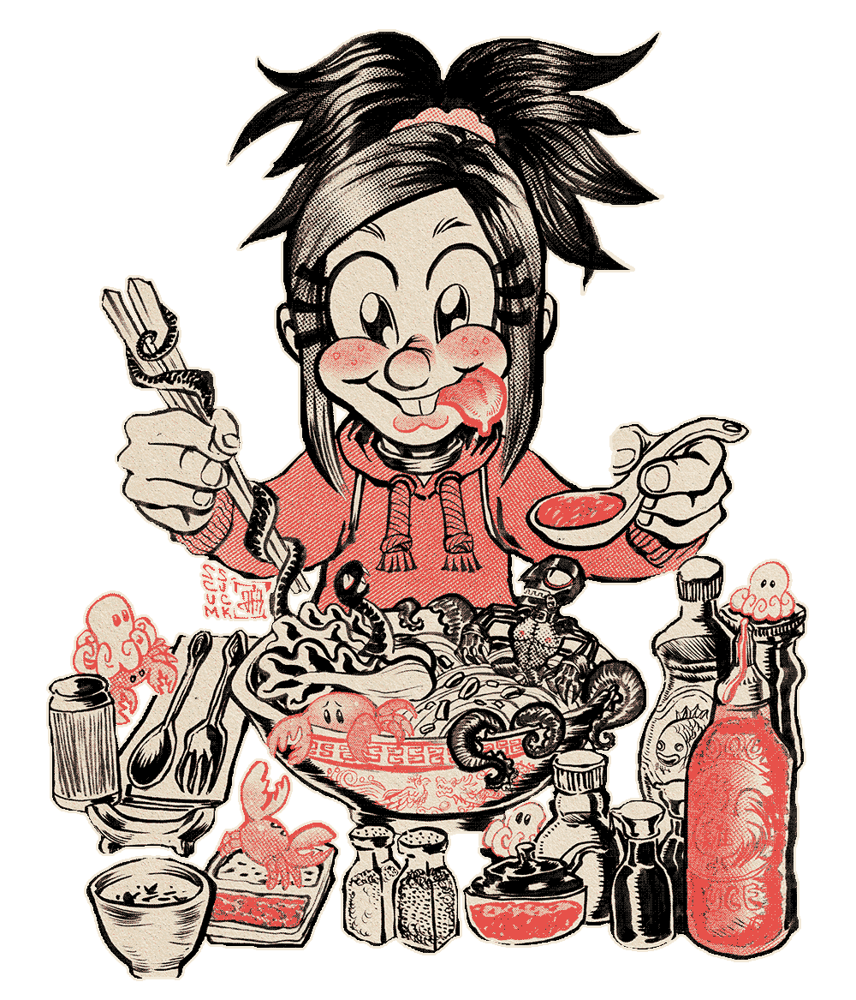

<figure></figure>
**JUST GORLY Thingz"** is a lesbian fujoshi web comic, chronicling **<a href="https://scumsuck.com/characters/ollienbasile/liv/">Liv's</a>** mundane slice of married life.  Living as a fujoshi, yumejoshi, and himejoshi... she does it all!

This comic is written and drawn by <a href="https://scumsuck.com/about/">SCUMSUCK</a>. 
            
 Our protaganist, <strong>Liv</strong> is a BL (yaoi) author.  Meaning she writes gay comics depicting man-on-man relationships. 
 Sometimes Liv is married to another gorl Scout, <strong>Sophie</strong>, the character of which belongs to my wife Shane.  On other occassions, Liv is also married to <strong><a href="https://scumsuck.com/characters/ollienbasile/basile/">an old spy, Basile.</a></strong>          
               
There is no schedule for this comic.  I draw these characters whenever I have an idea.

In Japan it's a jokey stereotype that fujoshi tend to be lesbians (since they're unattractive to men, they MUST find solace in each other!).  I think it's pretty cool when girls who like girls write about dudes who like dudes.  And I love fujo4fujo relationships.  So I made this comic.

<a href="/guestbook.html">Leave a comment on our guestbook</a>.  That would make Liv very happy.

### Updates

 - **August 29th, 2025:** Moving this comic to 11ty so it's easier to manage the pages.
 - **May 10th, 2023:** I've compiled the first 30 comic pages into <a href="https://store.scumsuck.com/products/Just-Gorly-Thingz-Digtal-PDF-zine-p551750089">a PDF</a>, as well as <a href="https://store.scumsuck.com/products/Just-Gorly-Thingz-a-lesbian-fujoshi-comic-zine-p551752573">a physical zine</a>.  Enjoy!
 - **March 3rd, 2023:** Moved to gorly.scumsuck.com!  Linking the comic should be much cleaner and easier now.  Also updated the CSS.
 - **December 3rd, 2022:** Guestbook page created :)  It looks like a long time between updates... but that's just for the html pages!  The actual comic has been updated a bit!
 - **May 25th, 2022:** Characters page created, with new art!
 - **May 11, 2022:** Updated About text and new character illustration of Liv :)      
 - **April 22, 2022:** Pages created with Rarebit

      